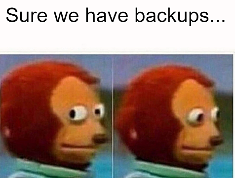

# PIS - Project Idea Saver

## What is it? 

PIS is a minimalistic web app for saving your project ideas. Everything is stored in your browser's local storage, so no need for account or server.

You can also export your ideas to a JSON file and import them back later.

The app comes with a list of project ideas.

## Demo

## Features

- Add and delete project ideas
- Tags and categories for every project
- Mark project as done.
- Search by everything: tag, status, name
- Export and import projects as JSON
- Preloaded  with projects from Programming Challenges, v4.0


## JSON Format

```JSON
[
  {
    "id": "1",
    "title": "Download Manager",
    "category": "Practical",
    "tags": [
      "medium"
    ],
    "done": false
  },
]
```


| Field      | Type      | Description                                                                                          |
| ---------- | --------- | ---------------------------------------------------------------------------------------------------- |
| `id`       | string    | Unique identifier. Projects added through the website get one from `crypto.randomUUID()`.            |
| `title`    | string    | Name of the project.                                                                                 |
| `category` | string    | The theme of the project (for example "Games").                                                      |
| `tags`     | string[]  | Any labels you like, such as the difficulty or "important". On the website, enter them as `tag, comma, separated`. |
| `done`     | boolean   | Whether the project is already finished.                                                             |
| `note`     | string    | Optional. Extra details about the project.                                                           |

Every `id` must be unique. Yu must have at least an id and title

## Local Storage 
On first launch app loads the starting project into browsers local storage. After that only local storage is used.

Changes are saved automatically in the browser only. JSON file is **not** updated when you add projects. to save your data to a file, use ** Export JSON* in the settings.

Clearing your browser's data deletes your projects, so please export a backup. 



## Tech stack

React, Typescript, Vite and Tailwind CSS

## Running locally

```bash 
npm install
npm run dev
```